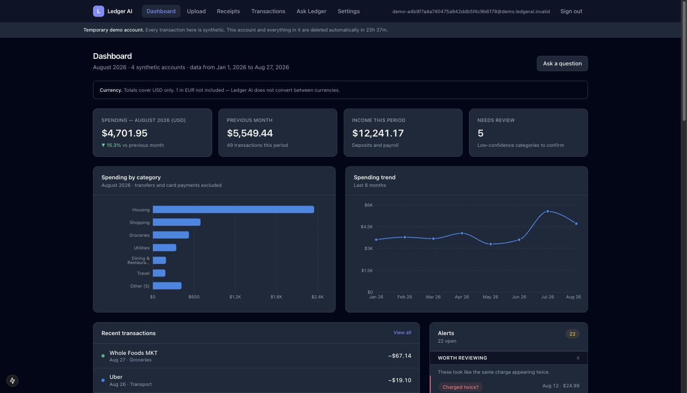
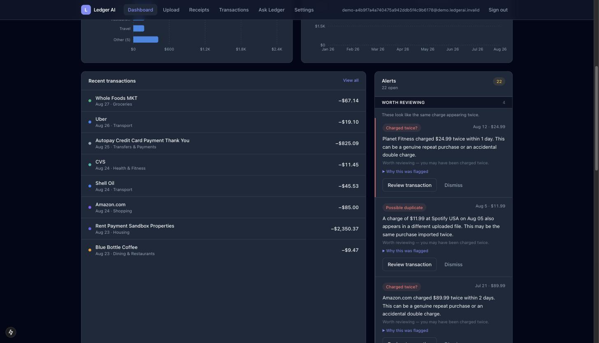
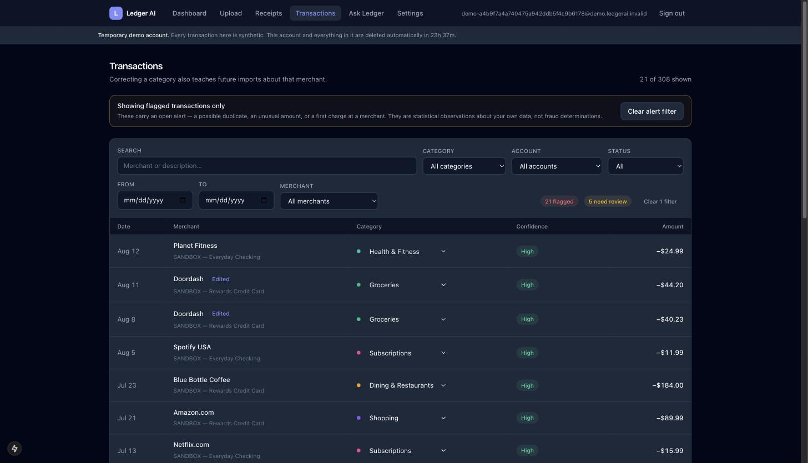
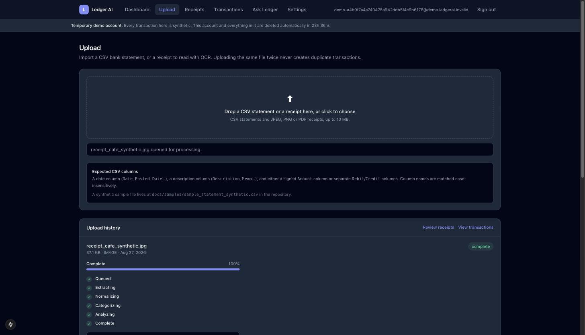
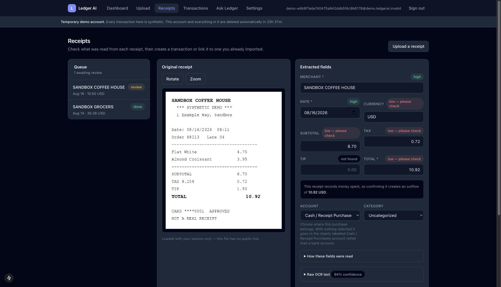
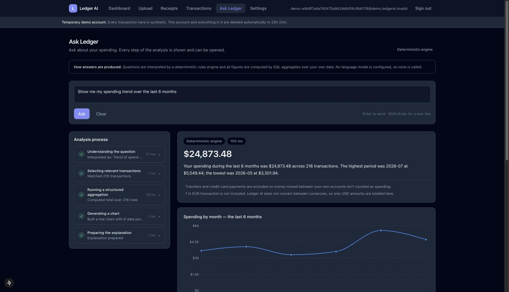
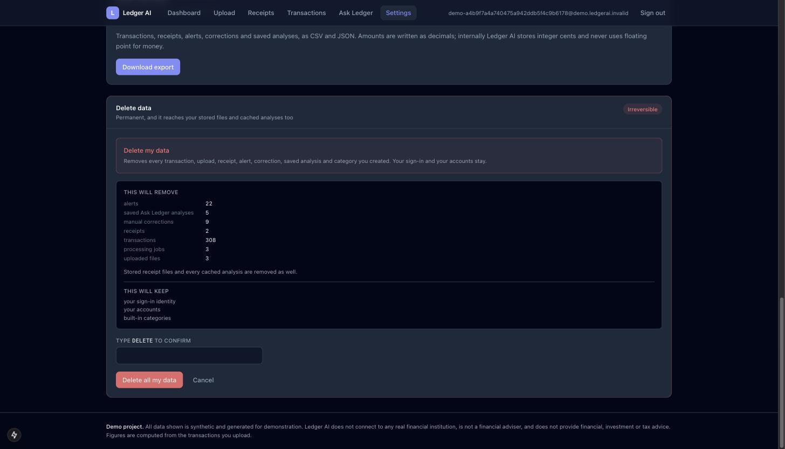
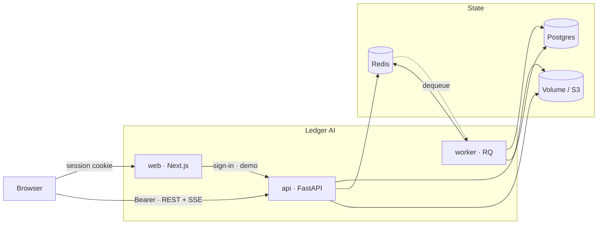

# Ledger AI

A personal finance workspace built around one constraint: **you can check every
number it shows you.**

Upload a CSV bank statement or photograph a receipt, and Ledger AI normalizes,
de-duplicates and categorizes the transactions, flags duplicates and unusual
charges with the statistics that produced them, and answers questions in plain
English — showing the plan it built, the SQL aggregate it ran, and the rows it
ran over, at every step.

> **Demo project.** Every figure in this repository and in every screenshot is
> **synthetic**, generated by a seeded PRNG. Ledger AI does not connect to any
> real financial institution, holds no real financial data, and does not provide
> financial, investment or tax advice.

[The demo](#the-demo) · [Architecture](#architecture) · [Quick start](#quick-start) · [Testing](#testing) · [Limitations](#known-limitations)

---

## Why I built this

Most "AI finance app" demos hand a prompt to a language model and print whatever
comes back. If the model says you spent $4,182 on groceries, there is nothing to
check. Often the model cannot check it either — it produced the figure by
predicting text, not by adding anything up.

That is a bad property for a toy. It is a disqualifying one for money.

So Ledger AI is built so that failure mode is structurally impossible, and the
architecture is the argument:

- **A question becomes a validated plan, not SQL and not an answer.** The planner
  emits an `AnalysisPlan` — a small, closed, Pydantic-validated struct
  (`services/analysis/plan.py`). Anything outside that vocabulary fails
  validation loudly rather than reaching the database.
- **The plan compiles to a parameterized SQL aggregate.** Every number a user
  sees is computed by Postgres (`services/analysis/executor.py`). No
  model-authored SQL is ever executed — there is no code path that could, and a
  test asserts the executor cannot even *import* an AI client.
- **The explanation is verified before it is shown.** Every numeric token in the
  narration is matched against the computed result set. A figure that is not in
  the result set causes the whole narration to be discarded and the deterministic
  template used instead (`services/analysis/narrate.py`).
- **The process is streamed and openable.** Five steps — understand, select,
  aggregate, visualize, explain — arrive over SSE as they complete, each
  expandable to show the resolved plan, the filters, the rows and the chart spec.

With no API key configured, Ledger AI is **fully functional**: a rules engine
plans the question, seeded merchant patterns and your own corrections do the
categorization, and template narration writes the prose. Adding a key changes
who *proposes* a plan and who *words* an answer — never who does the arithmetic.

### The user problem

Anyone with more than one account has the same three annoyances, and none of
them is "I need a chatbot":

| Problem | What Ledger AI does |
|---|---|
| Statements are inconsistent, and importing twice duplicates everything | Column layouts are detected, merchants normalized, and idempotency enforced by **database constraints** — not by an application check that a retry can race |
| Categorization is wrong often enough not to be trusted | Every category carries a confidence and a reason; correcting one row teaches every future import, and can be applied retroactively with the blast radius shown first |
| "Did I get charged twice?" is tedious to answer and easy to get wrong | Duplicate, near-duplicate and outlier detection, each alert opening to show the statistics behind it — as observations, never as fraud claims |

---

## The demo

The sign-in page's primary action is **Try the demo**. It provisions a private,
fully-populated account in a couple of seconds: three synthetic accounts, about
250 transactions across eight months, and a populated alerts surface.

| Property | How |
|---|---|
| Isolated | A demo visitor is an **ordinary user row**, so every `user_id` predicate that protects a real account protects them. There is no second, weaker path. |
| Private | The account is created server-side. The browser never receives an address or password for it, so it cannot be re-entered, shared or guessed at. |
| Temporary | `demo_expires_at` is a **column**, checked on every request. The browser mints fresh tokens as old ones expire, so a token-borne deadline could be renewed by leaving a tab open — a column cannot. |
| Cleaned up | An hourly sweep deletes expired accounts and everything they own: rows, stored files, cached analyses, the Redis index and queued jobs. |
| Safe | The sweep selects on `is_demo AND demo_expires_at IS NOT NULL AND demo_expires_at < now()`. A real account has neither column set. |
| Honest | Every account name is prefixed `SANDBOX —`, every description ends `[SYNTHETIC]`, and a standing banner counts down to deletion. |

Provisioning is idempotent per request key (`UNIQUE` on `users`), and the user,
accounts, transactions and alerts are written in **one transaction** — so a
failure half-way leaves no user at all, rather than an empty shell someone then
signs into.

---

## Screens

### Dashboard



Spend for the period, month-over-month change, category breakdown and a trend.
Transfers and card payments are excluded so money moved between your own accounts
is not counted as spending, and the exclusion is stated rather than assumed. The
trend covers as many months as the account actually has — plotting absent history
as `$0` would read as "you spent nothing", not "there is no data here".

### Alerts



Three bands, ordered by how much attention each deserves:

| Band | Contains | Framing |
|---|---|---|
| **Worth reviewing** | exact and near duplicates | the only class suggesting an action — you may have been charged twice |
| **Unusual for you** | unusual amounts, large-for-merchant charges | larger than your own history suggests, often perfectly normal |
| **For information** | first-time merchants | noted in passing, nothing to act on |

Every alert opens to show the statistics that produced it. None is a fraud claim,
and the panel says so.

### Transactions



Search, filter, and inline correction with optimistic updates that roll back
precisely on failure. Filter state lives in the **URL**, which is what makes the
dashboard's *"View all flagged transactions"* an ordinary link — and what makes a
filtered view shareable and the back button work.

Note that `21 flagged` and `5 need review` are different counts: an alerted
charge is usually categorized with full confidence and is not in the review
queue at all.

### Upload



Drag-and-drop CSV or receipt, with live progress through
`queued → extracting → normalizing → categorizing → analyzing → complete`.
Re-uploading identical bytes reports *"This exact file was already processed"*
and creates zero duplicate transactions.

### Receipt review



JPEG, PNG and PDF read locally with Tesseract. The original sits beside the
extracted fields, each with its own confidence — note `TIP` reading **not found**
where OCR could not recover it. Nothing is asserted that was not read.

A receipt is **inert until confirmed**: it holds values but owns no transaction,
because turning a photo into spending is the user's decision, not OCR's. On
confirmation it either links to a matching imported transaction or creates a new
one in a clearly-labelled `Cash / Receipt Purchases` account — never silently
attached to a bank account.

### Ask Ledger



Every step is timed and expandable. The caveats are part of the answer, not a
footnote: transfers excluded, and a EUR transaction named as excluded because
Ledger AI does not convert currencies.

### Settings and data controls



Export everything as a ZIP; delete your data while keeping your sign-in; or
delete the account outright. The preview counts **the same tables the delete
iterates**, and says what will be *kept* as well as what will go.

---

## Architecture



Full diagrams — processing lifecycle, Ask Ledger lifecycle, demo lifecycle and
deletion/retention — are in **[docs/architecture.md](docs/architecture.md)**.

```
apps/
├─ api/                     FastAPI · SQLAlchemy 2.0 · Alembic · RQ
│  └─ ledgerai/
│     ├─ models/            12 tables · integer-cent money · DB-enforced idempotency
│     ├─ routers/           auth · uploads · transactions · dashboard · analysis
│     │                     · receipts · alerts · settings
│     ├─ security/          JWT · rate limiting · filenames · validators · log redaction
│     ├─ jobs/              RQ queue · upload pipeline · retention · demo cleanup
│     └─ services/
│        ├─ categorize/     deterministic engine + optional LLM stage
│        ├─ analysis/       plan · planner · executor · charts · narrate · cache
│        ├─ alerts/         detectors + persistence
│        ├─ ocr/            preprocess · engine · parse
│        ├─ demo.py         ephemeral account provisioning and cleanup
│        └─ lifecycle.py    export · deletion · retention
└─ web/                     Next.js 15 App Router · TanStack Query · Recharts
```

### The data model

Twelve tables. The conventions matter more than the count:

- **Money is integer cents, everywhere.** `amount_cents BIGINT`, `Decimal` for
  parsing, never a float. Negative is outflow, positive inflow — including a
  confirmed receipt, whose total becomes a **negative** transaction so it
  increases spending rather than reducing it.
- **Every user-owned row carries `user_id` and is indexed on it**, and the
  predicate is applied in one shared selectable so no route can forget it.
- **Idempotency is a constraint, not a check.** `uploads(user_id, content_hash)`
  is unique, so identical bytes ingest once. `transactions.dedupe_hash` is unique
  and inserts use `ON CONFLICT DO NOTHING`, so a retried or half-failed job
  converges instead of duplicating spend. Two identical coffees on the same day
  survive as two rows, because the source row index is part of the hash.
- **Enums are `VARCHAR`, not native Postgres enums**, so adding a value later is
  a code change rather than a migration that locks the table.

See **[docs/data-model.md](docs/data-model.md)**.

### Ingestion

CSV column layouts are detected case-insensitively (`Date`/`Posted Date`,
`Description`/`Memo`, a signed `Amount` or separate `Debit`/`Credit`). Merchants
are normalized to a stable `merchant_key`, which is what makes "apply to all
matching" an exact indexed predicate rather than a `LIKE` over a display string.

### Categorization and correction memory

Four stages, highest priority first: **your own corrections** → seeded merchant
patterns → optional LLM → uncategorized. Anything below a 0.60 confidence
threshold lands in a manual-review queue rather than being asserted.

Correcting a row writes to `transaction_corrections`, which is both the audit
trail and the highest-priority categorization signal — so a correction teaches
every future import about that merchant. Applied retroactively, it updates every
row sharing the merchant key **except** rows the user previously corrected
individually, which are protected and reported. The count shown before you
confirm is produced by the same code that performs the write.

### Receipt matching

Candidates are scored on amount proximity, date distance and merchant
similarity, each contribution shown. A rejected candidate is persisted, so a
dismissed suggestion does not reappear after a reload.

### Alerts

Unusual-amount detection uses the **median and median absolute deviation**, not
mean and standard deviation — the outlier being hunted inflates a standard
deviation and hides itself. An amount normal *for its own merchant* is never
reported as unusual; without that rule a $59.99 subscription is flagged every
month for costing more than the typical $15.99 one.

### Ask Ledger

Structured plans, parameterized SQL, and numeric verification, as described
[above](#why-i-built-this). Results are cached under a key that folds in the
user's **data watermark** (latest `updated_at` + row count), so a correction
invalidates every cached answer automatically. There is no manual cache-busting
anywhere in the codebase and no way to serve a stale number after an edit.

Follow-ups carry no hidden state: a refinement is a named, deterministic
transform of the validated plan that produced the current answer, identified by
`(run_id, refinement_key)`. No pronoun resolution, no conversation history.

### Authentication and isolation

Next.js owns the browser session (httpOnly cookie) and mints a 15-minute HS256
bearer token; FastAPI verifies it with the shared `AUTH_SECRET`, requiring `exp`,
`sub`, `iss` and `aud`. Three providers — credentials, demo, and optional GitHub
— converge on that one contract.

A GitHub identity resolves by GitHub's **immutable account id** and never by
email address, *even a verified one*: "the provider verified this mailbox" says
nothing about who owns the Ledger AI account already using it, and linking on it
would let anyone able to set their GitHub address to a known user's address
inherit that user's data.

Cross-user access returns **404, never 403** — a 403 confirms the row exists.

### Rate limiting

Redis fixed-window counters: login 10/5min, demo sessions 5/hour, uploads
30/hour, analyses 60/hour, exports and destructive operations 5/hour.

Failure behaviour is **deliberately asymmetric**, because "fail open" and "fail
closed" are each wrong in one of the two situations the limiter runs in:

| Limit | Store down, development | Store down, production |
|---|---|---|
| login · demo · upload · analysis | allow | **refuse, 503** |
| export · deletion | allow | allow |

The top row is what an anonymous caller reaches, and is exactly where an
uncounted request is the thing being defended against. The bottom row is a
signed-in user acting on their own data; refusing those protects nobody.

The counter and its expiry are set in a single Lua `EVAL`. `INCR` followed by a
separate `EXPIRE` can be interrupted between the two, stranding a counter with no
TTL that nothing re-arms — turning a brief Redis blip into a permanent lockout.

### Decisions worth explaining

**RQ, not Celery.** Redis is already required for the analysis cache, the
pipeline is a single linear function rather than a routing graph, and RQ's
`job.meta` maps one-to-one onto the stage/progress model the UI renders. Celery's
strengths buy nothing here. The trade-off is accepted: RQ is Redis-only with no
built-in scheduler.

**Auth.js, not Clerk.** Anyone cloning this repo would need a Clerk account or
the demo is dead, and the build must run offline. HS256 is right because both
services are ours and co-deployed; RS256/JWKS is the correct upgrade the moment
third-party clients exist.

**Currencies are never added together.** FX is out of scope, so aggregates are
restricted to the base currency by a predicate in the same shared builder as the
user-id check, and anything excluded is *named*.

**Chart colour follows the data's job.** Category, trend and comparison charts
are a single measure — the axis labels already carry identity, so they use one
colour rather than spending a categorical palette on redundant encoding.

---

## Quick start

### Prerequisites

Docker · Node 22+ · Python 3.12 · [uv](https://docs.astral.sh/uv/) · Tesseract
(`brew install tesseract`)

### Steps

```bash
git clone <this-repo> && cd LedgerAI

# 1. Set the SAME secret in BOTH files — the API verifies the token the web app
#    mints, so a mismatch means sign-in works and every API call then 401s.
#      .env                 AUTH_SECRET=...
#      apps/web/.env.local  AUTH_SECRET=...
cp .env.example .env
cp apps/web/.env.example apps/web/.env.local
openssl rand -base64 32     # paste into both

make setup      # install backend + frontend dependencies
make up         # Postgres (5433), Redis (6379), MinIO (9000/9001)
make migrate    # apply migrations
make seed       # generate the synthetic development dataset
make dev        # api :8000 · worker · web :3000
```

Open <http://localhost:3000> and press **Try the demo** — no credentials needed.
To use the seeded development account instead, sign in with `DEMO_USER_EMAIL` /
`DEMO_USER_PASSWORD` from your `.env`.

Neither GitHub OAuth nor an OpenAI key is required. The app is fully functional
without both.

### Optional: enable the AI stages

```bash
# .env
AI_ENABLED=true
OPENAI_API_KEY=sk-...
```

This changes who proposes a plan and who words an explanation. Numbers stay
SQL-computed and verified either way. Every response is Pydantic-validated with
a deterministic fallback on timeout, rate limit, malformed JSON, schema
violation, or a fabricated figure.

### Optional: GitHub sign-in

Create an OAuth app at <https://github.com/settings/developers> with callback
`http://localhost:3000/api/auth/callback/github`, then set `AUTH_GITHUB_ID` and
`AUTH_GITHUB_SECRET` in `apps/web/.env.local`. Leave them blank and the button
is simply not rendered.

### Useful commands

| Command | What it does |
|---|---|
| `make dev` | api, worker and web together |
| `make test` | backend + frontend suites |
| `make lint` | ruff · mypy · eslint · tsc |
| `make seed RESET=1` | regenerate the development dataset |
| `make sweep` | retention sweep |
| `make demo-sweep` | delete expired demo accounts |
| `make prod-build` | build the three production images |
| `make prod-smoke` | verify the production containers |

### Production images

```bash
export AUTH_SECRET=$(openssl rand -base64 32)
export DEMO_USER_PASSWORD=$(openssl rand -base64 24)
make prod-build && make prod-up && make prod-smoke
```

Three images, each non-root with a health check. The API and worker are **two
targets of one Dockerfile**, so both build from a clean clone independently:

```bash
docker build --target api    -t ledgerai-api    apps/api
docker build --target worker -t ledgerai-worker apps/api
```

Deployment, environment variables, migrations, health checks, scheduling,
rollback and backups are documented in
**[docs/deployment.md](docs/deployment.md)**.

---

## Testing

```bash
make test      # 594 backend tests · 192 frontend tests
make lint      # ruff · mypy · eslint · tsc --noEmit
```

The strategy is to test **properties, not implementations**, and to make failure
modes reproducible without network access:

- **Isolation is tested adversarially.** A second user cannot reach the first's
  data through any endpoint — asserted per operation, generated from the live
  OpenAPI document so a new route cannot quietly skip the check.
- **Preview matches reality.** The deletion preview is asserted to equal the rows
  actually deleted, table by table, with a positive control proving the fixture
  populates every table so no comparison passes vacuously.
- **Security regressions are pinned to the attack.** A forged `X-Forwarded-For`
  rotating on every request must not buy extra login attempts; a counter
  stranded without a TTL must heal on next use.
- **The AI path never touches the network.** Timeout, rate limit, malformed JSON,
  schema violation and fabricated figures are all exercised with injected fake
  clients, so the suite needs no API key.
- **OCR runs through a fake engine** for parsing tests, so no Tesseract binary is
  needed — while preprocessing tests rasterize real files.

CI runs backend, frontend, migrations (including `downgrade base` and back, and a
model-drift check) and Docker builds — verifying non-root execution, that the
worker builds with **no API image present**, and that both Compose files parse.

---

## Known limitations

Stated plainly, because a portfolio piece that hides these is less trustworthy,
not more.

- **OCR is English-only** (`eng` traineddata); handwritten receipts are out of
  scope. Fields it cannot read are marked *not found* rather than guessed.
- **No FX conversion.** Non-base-currency amounts are reported separately and
  never summed into a base-currency total.
- **Alerts are summarised, not browsed.** The dashboard shows the eight most
  serious open alerts and links to the flagged transactions; there is no
  dedicated alerts page.
- **Alerts are statistical observations** about your own uploaded data — not
  fraud detection, and not a claim that anything is wrong.
- **Receipt-to-transaction matching is a suggestion**, always confirmed by a
  human before anything is written.
- **Not deployed.** The deployment configuration and documentation are complete
  and the images are verified locally, but no hosting account exists, nothing is
  provisioned, and no GitHub OAuth application has been created.
- **Storage on a volume does not scale horizontally.** The S3 adapter exists and
  is a configuration change; the volume is the deliberate choice for a demo.

### Deliberately not built

**Connected bank accounts.** Ledger AI does not connect to any financial
institution. A real aggregator integration needs bank-grade credential handling
and is out of scope; Settings says so rather than showing a dead button.

**"Unused subscription" detection.** Transaction data proves only that a
subscription was *charged* — never that it went unused. Ledger AI reports
recurring charges and says exactly that. Detecting genuinely unused
subscriptions needs product-usage data from each provider, which is an
integration, not an inference available from a bank statement.

---

## Documentation

| Document | Contents |
|---|---|
| [docs/architecture.md](docs/architecture.md) | System, processing, analysis, demo and deletion lifecycles |
| [docs/data-model.md](docs/data-model.md) | Tables, constraints, indexes |
| [docs/api.md](docs/api.md) | Every operation, what is public, and error semantics |
| [docs/ai-usage.md](docs/ai-usage.md) | What the model sees, what it never sees, and every fallback |
| [docs/security.md](docs/security.md) | Isolation, auth, demo expiry, OAuth linking, rate limiting, lifecycle |
| [docs/deployment.md](docs/deployment.md) | Railway shape, variables, health checks, rollback, backups |

---

## A note on the data

Everything is fabricated by `scripts/seed_synthetic.py` and
`services/demo_data.py` from a seeded PRNG. Merchant names are real-world brands
used as plausible labels only — nothing is contacted, integrated or represented.
Accounts are prefixed `SANDBOX —` with `0000`-series masks, descriptions carry a
`[SYNTHETIC]` marker, and the sample receipts are generated images stamped
**NOT A REAL RECEIPT**.
