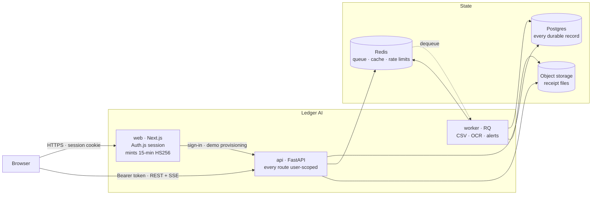

# Architecture

## System architecture



The browser calls the API **directly** for data rather than proxying through
Next.js: Ask Ledger streams over SSE, and an extra hop buys nothing but
buffering risk. Next.js is only in the path for the session and for minting
tokens.

## Request paths

```
                      ┌──────────────────────────────┐
  Browser ────────────▶ Next.js (App Router)         │
     │                 │  · Auth.js session (cookie) │
     │                 │  · /api/auth/token mints a  │
     │                 │    15-min HS256 bearer      │
     │                 └──────────────────────────────┘
     │
     │  Authorization: Bearer <HS256>
     ▼
  ┌──────────────────────────────────────────────┐
  │ FastAPI                                      │
  │  deps.get_current_user  → CurrentUser        │──▶ Postgres (async, psycopg3)
  │  routers/                                    │
  │  services/analysis/  (SSE stream)            │──▶ Redis  (analysis cache)
  │  routers/uploads     (enqueue)               │──▶ Redis  (RQ queue) ──▶ worker
  └──────────────────────────────────────────────┘                          │
                                                      MinIO ◀───────────────┘
```

Two SQLAlchemy engines share one set of models: an **async** engine for the
FastAPI request path (so SSE streaming never blocks the event loop), and a
**sync** engine for the RQ worker, Alembic, and the seed scripts, which are
plain processes.

## The Ask Ledger pipeline

```
question
   │
   ▼
┌──────────────┐   AnalysisPlan (Pydantic, extra="forbid")
│ RulePlanner  │──────────────────────────────┐
│ (Phase 1)    │                              │
│ LLMPlanner   │  validation failure → falls  │
│ (Phase 2)    │  back to RulePlanner         │
└──────────────┘                              ▼
                                       ┌─────────────┐
                                       │  Executor   │ parameterized SQLAlchemy
                                       │             │ user_id predicate always applied
                                       └──────┬──────┘
                                              │ ExecutionResult (all numbers)
                              ┌───────────────┼───────────────┐
                              ▼               ▼               ▼
                        build_chart     build_narration   supporting rows
                              │               │
                              │        verify_numeric_claims
                              │        (fabricated figure → discard)
                              ▼               ▼
                          ChartSpec       narration
```

Each stage emits `started` then `completed` SSE frames, persisted to
`analysis_steps` so a cached replay renders exactly the same inspectable
process as a live run.

### Why the plan is a struct

An LLM that emits SQL can produce a query nobody reviews. An LLM that emits an
answer can produce a number nobody can check. An LLM that emits a small closed
struct can do neither: the struct is validated, and the struct is the *only*
thing the executor accepts.

`AnalysisPlan` is frozen, forbids unknown fields, and validates coherence
(a comparison requires `compare_to`; a breakdown requires `group_by`; a trend
must group by month or week). A hallucinated field fails loudly rather than
being silently ignored.

## Upload pipeline

```
POST /api/uploads
  ├─ read in 64 KB chunks, counting bytes (never trust Content-Length)
  ├─ sniff content type (a PNG named .csv is an image)
  ├─ validate CSV headers and shape
  ├─ sha256(bytes) → uploads.content_hash
  │    └─ UNIQUE(user_id, content_hash) → identical file returns the original
  ├─ sanitize filename → generate UUID storage key → MinIO
  ├─ INSERT uploads + processing_jobs
  └─ RQ enqueue(process_upload, on_failure=mark_job_failed)

worker:  extracting → normalizing → categorizing → complete
         each transition writes processing_jobs.stage/progress (polled by the UI)
         INSERT ... ON CONFLICT (dedupe_hash) DO NOTHING
```

`on_failure=mark_job_failed` runs in the worker process rather than the work
horse, so a job still surfaces as failed in the UI when the horse is killed
outright (OOM, SIGKILL, a macOS fork-safety abort) and never gets to run its
own `except` block.

## Receipts

```
upload (jpeg/png/pdf)
   │  rasterize (pypdfium2 — no poppler needed) → grayscale → autocontrast → scale
   ▼
Tesseract (TSV) ──▶ per-word confidences
   │
   ▼
parse: line-anchored labels, most-specific-first, last money token per line
   │      + arithmetic check: subtotal + tax + tip ≈ total
   ▼
receipt row (status = pending | needs_review)   ← no transaction exists yet
   │
   ├── review page: image beside editable fields, per-field confidence
   │
   ├── confirm "create" → ONE transaction, amount_cents NEGATIVE,
   │                      account chosen by the user or the named synthetic one
   └── confirm "link"   → attaches to an existing transaction, changes nothing
```

Three parsing rules exist because a real Tesseract run produced the failure they
guard against: a naive `TOTAL\s+([\d.]+)` matches inside `SUBTOTAL`; OCR emits
`4,99` for `4.99`; and `TAX 8.25%  2.31` defeats a trailing-anchored pattern.

## Alerts

Each detector is a pure function over a transaction plus its history, so every
threshold is unit-testable at its exact boundary. Unusual-amount detection uses
median and MAD, and suppresses anything that is normal for its own merchant —
without that, a $59.99 subscription is flagged every month for costing more than
the typical $15.99 one.

Idempotency is free: `UNIQUE(transaction_id, alert_type)` means re-running
detection inserts nothing.

### Severity is a presentation contract

Severity is decided once, in the detectors, and the UI groups by it rather than
inventing its own ranking:

| Severity | Detectors | Meaning shown to the user |
|---|---|---|
| `high` | `exact_duplicate`, `near_duplicate` | *Worth reviewing — you may have been charged twice.* |
| `medium` | `unusual_amount`, `large_for_merchant` | *Unusual compared with your own history. Not necessarily a problem.* |
| `low` | `new_merchant` | *For information only.* |

Duplicates are the only class that implies an action, so they lead. The text for
each band comes from `SEVERITY_INTENT` in the detectors module and is returned
by both the dashboard and `/api/alerts`, so a future surface cannot drift from
this wording. No band asserts wrongdoing — asserted by test.

## Categorization

Ordered stages, first confident hit wins:

| # | Stage | Confidence | Notes |
|---|---|---|---|
| 1 | Correction memory | 1.00 | Keyed on normalized merchant; a user edit teaches every later import |
| 2 | Merchant rules | 0.90 | ~428 seeded patterns, indexed longest-first so specific beats generic |
| 3 | Keyword heuristics | 0.65 | Words inside the description |
| 4 | Structural | 0.50 | Unmatched credit → income |
| 5 | Uncategorized | 0.00 | → manual review queue |

Below 0.60 sets `needs_review`. Phase 2 inserts the LLM categorizer between 3
and 4; nothing above it changes.

## Corrections

```
user picks a new category
        │
        ▼
GET /api/transactions/{id}/correction-impact     ← nothing is written
        │  matching_count / affected_count / protected_count / affected_ids
        ▼
confirmation row: "Apply to all matching transactions (N others)"  [x] on by default
        │
        ▼
PATCH /api/transactions/{id}  { category_id, apply_to_matching }
        ├─ target row updated, correction recorded with scope=individual|bulk
        ├─ if retroactive: every sibling sharing (user_id, merchant_key)
        │    minus rows carrying an INDIVIDUAL correction for this field
        └─ each sibling gets its own correction row (scope=bulk)
```

The preview and the write share `services/corrections.py::compute_impact`, so
the number the user approves is the number that actually changes. `affected_ids`
comes back with the preview, which is what lets the client update exactly the
right rows optimistically — and roll back to an exact snapshot if the write
fails.

Both paths select rows through `_siblings()`, where `user_id` is the first and
non-optional predicate. Two users with the same merchant name have the same
`merchant_key`, and neither can reach the other's rows.

## Deployment shape

```
                 ┌──────────┐
   browser ─────▶│   web    │  Next.js standalone, non-root
                 └────┬─────┘
                      │ bearer token
                 ┌────▼─────┐        ┌──────────┐
                 │   api    │───────▶│ postgres │
                 │ FastAPI  │        └──────────┘
                 └────┬─────┘        ┌──────────┐
                      │  enqueue ───▶│  redis   │◀──┐
                      │              └──────────┘   │
                 ┌────▼─────┐                       │
                 │  worker  │───────────────────────┘
                 │    RQ    │
                 └────┬─────┘
                      │  receipts
                 ┌────▼─────────────┐
                 │ object storage   │
                 └──────────────────┘

   migrate ── one-shot, runs to completion before api and worker start
```

Three images, each non-root with a health check: `ledgerai-web` (82 MB),
`ledgerai-api` and `ledgerai-worker` (145 MB, sharing a base so OCR behaves
identically). Dependencies install from `uv.lock` with `--frozen`, so an image
built today and one built next month contain the same versions.

**Migrations are a release step, never a per-replica boot step.** Two replicas
racing `alembic upgrade head` can leave a partially-applied migration, which is
the worst state to recover from. In Compose that is a one-shot `migrate`
service the others wait on; in a hosted environment it is a pre-deploy command
on a single service.

## Processing lifecycle: CSV and receipts

One upload endpoint, one job, two branches — so idempotency, progress
reporting and failure handling are written once.

```mermaid
flowchart TD
    U["POST /api/uploads"] --> H{"content hash<br/>seen for this user?"}
    H -->|"yes"| DUP["status: duplicate<br/>no job, no rows"]
    H -->|"no"| ST["store bytes<br/>enqueue RQ job"]

    ST --> Q["queued"]
    Q --> EX["extracting"]

    EX --> KIND{"CSV or image?"}

    KIND -->|"CSV"| PARSE["parse · detect columns"]
    PARSE --> NORM["normalizing<br/>merchant + dedupe hash"]
    NORM --> CAT["categorizing<br/>corrections → rules → LLM"]
    CAT --> INS["INSERT ... ON CONFLICT DO NOTHING<br/>on dedupe_hash"]
    INS --> AN["analyzing<br/>alert detectors"]
    AN --> OK["complete"]

    KIND -->|"image / PDF"| OCR["OCR · Tesseract<br/>rasterize PDF pages"]
    OCR --> FIELDS["parse merchant, date,<br/>subtotal, tax, tip, total"]
    FIELDS --> REV["receipt: needs_review<br/>owns no transaction yet"]
    REV --> USER{"user confirms"}
    USER -->|"link"| LINK["attach to an existing transaction"]
    USER -->|"create"| NEW["create transaction<br/>in Cash / Receipt Purchases"]

    EX -.->|"raises"| FAIL["failed<br/>message the user can act on"]
    OCR -.->|"raises"| FAIL
    Q -.->|"worker killed;<br/>retention sweep"| FAIL

    style DUP fill:#1e293b,stroke:#475569
    style FAIL fill:#3f1d1d,stroke:#b91c1c
    style OK fill:#14312a,stroke:#10b981
```



A receipt is **inert until confirmed**: it holds extracted values but owns no
transaction, because turning a photo into spending is a decision the user
makes, not one OCR makes.

## Ask Ledger lifecycle

```mermaid
flowchart TD
    Q["question"] --> CK{"cache hit?<br/>digest of user +<br/>question + data watermark"}
    CK -->|"yes"| REPLAY["replay the stored run<br/>same steps, same numbers"]
    CK -->|"no"| PLAN["understand<br/>rules engine → typed QueryPlan"]

    PLAN --> VALID{"plan valid<br/>and in scope?"}
    VALID -->|"no"| DECLINE["decline, and say why"]
    VALID -->|"yes"| SEL["select<br/>parameterized SQL, user_id bound"]

    SEL --> AGG["aggregate<br/>SUM/COUNT in Postgres"]
    AGG --> VIZ["visualize<br/>chart spec from the result set"]
    VIZ --> NARR["explain<br/>template, or LLM wording"]
    NARR --> VER{"every number in the prose<br/>present in the result set?"}
    VER -->|"no"| FALLBACK["fall back to the template"]
    VER -->|"yes"| OUT["answer + chart + caveats"]
    FALLBACK --> OUT
    REPLAY --> OUT

    style DECLINE fill:#3f2d15,stroke:#d97706
    style VER fill:#1e293b,stroke:#818cf8
    style OUT fill:#14312a,stroke:#10b981
```



Each box is streamed to the browser as it happens and can be expanded to show
its own input and output. **The language model never computes a number** — it
may choose a plan and word an explanation, and the numeric verification step
rejects any sentence containing a figure that is not in the result set.

## Demo account lifecycle

```mermaid
flowchart TD
    CLICK["Try the demo"] --> LIMIT{"within<br/>DEMO_SESSION_LIMIT?"}
    LIMIT -->|"no"| THROTTLE["429 · try again shortly"]
    LIMIT -->|"yes"| KEY["claim UNIQUE request key"]

    KEY --> RACE{"key already taken?"}
    RACE -->|"yes"| REUSE["return the existing account<br/>retry is free"]
    RACE -->|"no"| SEED["ONE transaction:<br/>user + 3 accounts<br/>+ ~250 transactions<br/>+ alerts"]

    SEED --> FAILED{"seeding failed?"}
    FAILED -->|"yes"| ROLL["roll back entirely<br/>no half-built account"]
    FAILED -->|"no"| LIVE["demo_expires_at = now + 24h"]

    LIVE --> USE["ordinary user row:<br/>every user_id predicate<br/>isolates it"]
    USE --> CHECK{"on every request:<br/>demo_expires_at passed?"}
    CHECK -->|"no"| USE
    CHECK -->|"yes"| GONE["401 · demo session has ended"]

    GONE --> SWEEP["hourly sweep"]
    SWEEP --> PURGE["cascade DELETE user<br/>+ files + cache + queued jobs"]

    style THROTTLE fill:#3f2d15,stroke:#d97706
    style ROLL fill:#3f1d1d,stroke:#b91c1c
    style PURGE fill:#3f1d1d,stroke:#b91c1c
    style LIVE fill:#14312a,stroke:#10b981
```



Expiry is a **column, not a token claim**. The browser mints a fresh token
whenever the old one nears expiry, so a token-borne deadline would let anyone
who kept the tab open renew past it forever.

## Deletion and retention lifecycle

```mermaid
flowchart TD
    subgraph user["User-initiated"]
        DD["Delete my data"] --> PRE["dry run:<br/>count the SAME tuple<br/>the delete iterates"]
        PRE --> SHOW["show what goes<br/>AND what stays"]
        SHOW --> TYPE{"typed DELETE?"}
        TYPE -->|"no"| STOP["nothing removed"]
        TYPE -->|"yes"| RUN["delete rows · files<br/>· cache · queued jobs"]
        DA["Delete my account"] --> PRE
    end

    subgraph auto["Scheduled"]
        CRON1["demo cleanup · hourly"] --> EXP["expired ephemeral demos"]
        CRON2["retention · daily"] --> STUCK["jobs abandoned mid-pipeline"]
        CRON2 --> OLDF["files of uploads failed >7d"]
        CRON2 --> OLDR["receipts unconfirmed >30d"]
    end

    RUN --> FOUR["Postgres · storage · Redis · RQ"]
    EXP --> FOUR
    STUCK --> FOUR
    OLDF --> FOUR
    OLDR --> FOUR

    style STOP fill:#1e293b,stroke:#475569
    style FOUR fill:#3f1d1d,stroke:#b91c1c
```



The preview and the delete iterate **one shared tuple** (`DATA_ONLY_MODELS`).
When they were two hand-maintained lists they drifted in both directions — the
preview counted accounts that data-only deletion keeps, and omitted the
categories it removes. For an irreversible operation whose entire purpose is
informed consent, that is the preview lying about both halves.

## Caching

```
cache_key = sha256(user_id | normalized_question | max(updated_at) | row_count)
```

Folding the data watermark into the key means a correction invalidates every
cached answer for that user automatically. There is no manual cache-busting
anywhere in the codebase, and no way to serve a stale number after an edit.
